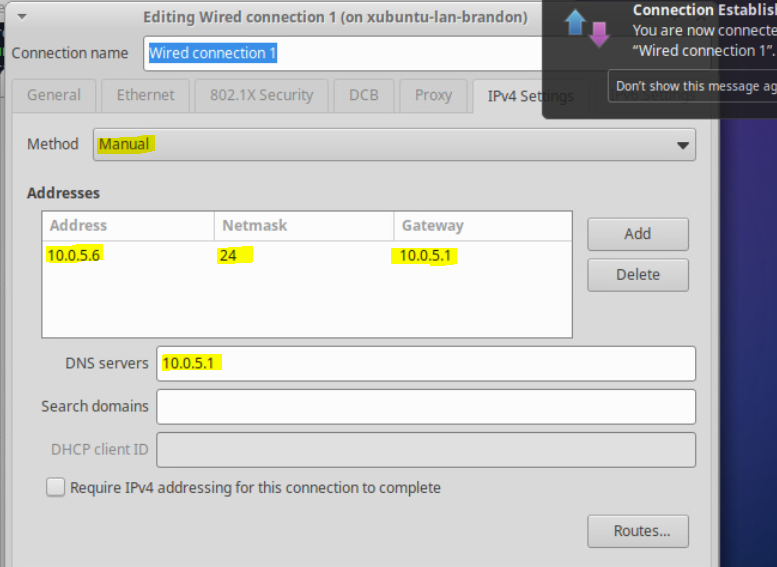

# Project 1 - Network Redundancy

Vyos 1 Configuration:

Vyos Password Change:

<pre><code>// set system login user [username] authentication plaintext-password [new-password]

// set system host-name vyos01-brandon

Vyos01 Interfaces:

// set interfaces ethernet eth0 address 10.0.17.13/24
// set interfaces ethernet eth0 description WAN
// set protocols static route 0.0.0.0/0 next-hop 10.0.17.2

Create Ranges for other networks OPT, LAN, DMZ:

LAN // set interfaces ethernet eth1 address 10.0.5.2/24
    // set interfaces ethernet eth1 description LAN
    
OPT // set interfaces ethernet eth2 address 10.0.6.2/24
    // set interfaces ethernet eth2 description OPT
    
    
Vyos02 Interfaces:

// set interfaces ethernet eth1 address 10.0.5.2/24
// set interfaces ethernet eth1 description LAN
// set interfaces ethernet eth0 description WAN
// set interfaces ethernet eth2 description OPT

// set interfaces ethernet eth0 address 10.0.17.43 (xubuntu-wan)
// set interfaces ethernet eth2 address 10.0.6.2 (OPT)
// set protocols static route 0.0.0.0/24 next-hop 10.0.17.2
// set system name-server 10.0.17.2


<strong>Xubuntu-WAN Configuration:
</strong><strong>
</strong><strong>Log in and change hostname, add user, and make new user a sudo user:
</strong><strong>
</strong><strong>// sudo hostnamectl set-hostname xubuntu-wan-brandon
</strong><strong>
</strong><strong>// sudo adduser brandon
</strong><strong>// sudo usermod -aG sudo brandon
</strong><strong>
</strong>* Xubuntu-WAN Network Configurations:
</code></pre>

<figure><figcaption><p>Xubunut-WAN Netowork Configuration</p></figcaption></figure>

Complete the same steps above on the Xubuntu-LAN machine.

Xubuntu-LAN-Brandon Network Configuration:

<figure><figcaption><p>Xubuntu-LAN-Brandon Network Configurations</p></figcaption></figure>


Web-01 Configuration

nmtui is installed on Rocky Linux

..png>)


After that, create new user, '-aG wheel brandon' the account, and change hostname through nmtui.

Allow SSH and HTTP on Web01:

sudo firewall-cmd --permanent --zone-public --add-port=80/tcp

sudo firewall-cmd --permanent --zone-public --add-port=22/tcp

<figure><figcaption><p>Web01 ports 22/80 open</p></figcaption></figure>

DNS , NAT, Port Forwarding: (Do on both Vyos machines)


DNS:&#x20;

set service dns forwarding allow-from 10.0.5.0/24

set service dns forwarding listen-address 10.0.5.1

set service dns forwarding system


NAT: Creating Sources

set nat source rule 10 description 'NAT - LAN to DMZ'

set nat source rule 10 outbound-interface eth0

set nat source rule 10 source address 10.0.5.0/24

set nat source rule 10 translation address masquerade


Port Forwarding:

Set the SSH port for Web01

set nat destination rule 20 destination address 10.0.17.103 (Virtual IP - WAN)

set nat destination rule 20 destination port 22

set nat destination rule 20 inbound-interface eth0

set nat destination rule 20 translation address 10.0.5.100 (Web01 IP)

set nat destination rule 20 translation port 22

set nat destination rule 20 description 'SSH to Web01'

set nat destination rule 20 protocol tcp


Port 80:

set nat destination rule 30 destination address 10.0.17.103 (Virtual IP - WAN)

set nat destination rule 30 destination port 80

set nat destination rule 30 inbound-interface eth0

set nat destination rule 30 translation address 10.0.5.100 (Web01 IP)

set nat destination rule 30 translation port 80

set nat destination rule 30 description 'HTTP to Web01'

set nat destination rule 30 protocol tcp


```

* VRRP

Do this on both Vyos machines

Vyos1

set high-availability vrrp group 'langroup0' vrid 10
set high-availability vrrp group 'langroup0' interface eth1
set high-availability vrrp group 'langroup0' address 10.0.5.1

set high-availability vrrp group 'optgroup0' vrid 20
set high-availability vrrp group 'optgroup0' interface eth2
set high-availability vrrp group 'optgroup0' address 10.0.6.1

set high-availability vrrp group 'wangroup3' vrid 153
set high-availability vrrp group 'wangroup3' interface eth0
set high-availability vrrp group 'wangroup3' address 10.0.17.103

to set Vyos 1 as Master, set VRRP priority to 200
set high-availability vrrp group 'wangroup3' priority 200


Vyos2

set high-availability vrrp group 'langroup0' vrid 10
set high-availability vrrp group 'langroup0' interface eth1
set high-availability vrrp group 'langroup0' address 10.0.5.1

set high-availability vrrp group 'optgroup0' vrid 20
set high-availability vrrp group 'optgroup0' interface eth2
set high-availability vrrp group 'optgroup0' address 10.0.6.1

set high-availability vrrp group 'wangroup3' vrid 153
set high-availability vrrp group 'wangroup3' interface eth0
set high-availability vrrp group 'wangroup3' address 10.0.17.103


2FA done following this site:
```


2FA On Web01


