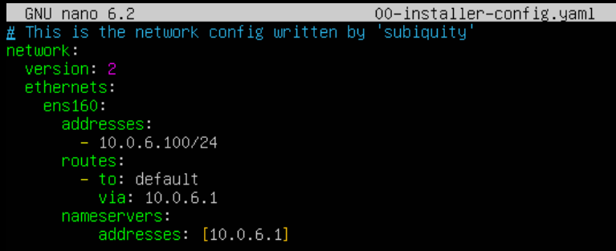

# Project 2 - Web Redundancy


## Configure Web02


```
sudo adduser brandon
sudo usermod -aG wheel brandon
```


Use nmtui to configure.

10.0.5.101 - IPv4 Address

10.0.5.1     - Gateway and DNS Server


```
sudo firewall-cmd --permanent --zone-public --add-port=80/tcp
sudo firewall-cmd --permanent --zone-public --add-port=22/tcp
sudo firewall-cmd --reload
```


## Configuring HaProxy Servers

Ubuntu

```
sudo set-hostname 
sudo hostnamectl set-hostname ha1-brandon
sudo adduser brandon
sudo usermod -aG sudo brandon
```

Netplan must be used, my configuration:

<figure><figcaption><p>Ha1 Netplan Configuration</p></figcaption></figure>

I need to add NAT Source rules on Vyos1 and Vyos2 as I did not do that in project 1

## Adding NAT Source Rules to Vyos1 + Vyos2

```
set nat source rule 20 description 'NAT FROM OPT'
set nat source rule 20 outbound-interface 'eth0'
set nat source rule 20 source address '10.0.6.0/24'
set nat source rule 20 translation address 'masquerade'
```

## HaProxy 2 Netplan Configuration

<figure><figcaption><p>HaProxy2 Netplan Configuration</p></figcaption></figure>


## Installing / Configuring HaProxy


Config HAproxy abd Keepalived



```
sudo apt install haproxy -y
sudo nano /etc/haproxy/haproxy.cfg
```

<figure><figcaption><p>HAproxy config</p></figcaption></figure>

Save and Test the config:

```
sudo haproxy -f /etc/haproxy/haproxy.cfg -c

sudo systemctl restart haproxy
```


## Configuring Keepalived


```
sudo apt install keepalived -y
sudo nano /etc/keepalived/keepalived.conf
```

<figure><figcaption><p>HAproxy MASTER config</p></figcaption></figure>

For the BACKUP, HA2, set the state to 'BACKUP'


## !Configure HA2 before testing Keepalived!


## Test and Start Keepalived


```
sudo keepalived -t
# SECURITY VIOLATION for scripts is ok, ignore
sudo systemctl start keepalived (on both servers)
```


## Verify High Availability

On the primary server, the VIP should be active.&#x20;

<figure><figcaption><p>HA1 VIP verification on ens160</p></figcaption></figure>

We will not be able to see the IP address on the backup server like in the picture above as it is in the backup state. Keepalived will automatically manage the failover process. If the primary server goes down or HAProxy becomes unresponsive, the VIP will migrate to the backup server.&#x20;

